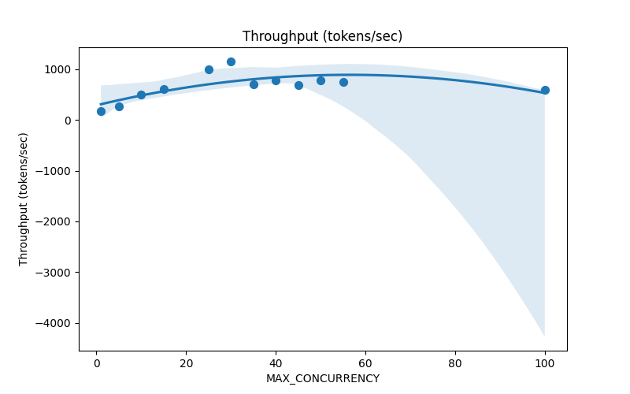

## Part 1: Deploy an Open-Source LLM

This project uses vLLM as the inference server for Meta-Llama-3.2-1B-Instruct because it provides high-throughput, memory-efficient inference with OpenAI-compatible REST API support.
I prefered to deploy it directly with local python enviroment as docker includes extra over-head for my private computer ( less flexability in playing with paramters and taking more memory)

## Why vLLM?
vLLM is chosen for its efficient memory usage, high throughput, and native support for OpenAI-compatible REST APIs, making it ideal for local LLM inference.

## Quickstart
Make sure you have nvidia GPU with at least 4GB of Dedicated GPU memory and recently released linux OS ( tested on Ubuntu 22.04.5 LTS  ) 

run 
```bash
pip install -r requirments.txt
```

### Launch the vLLM Server
make sure you have a user and asked in hugging face for access for the model you chose ( in this example [meta-llama/Llama-3.2-1B-Instruct](https://huggingface.co/meta-llama/Llama-3.2-1B-Instruct) )
make sure you got Hugging face generated token (https://huggingface.co/settings/tokens)
replace "you_hf_token" with the generated token in the following command
set up .env file with 
```bash
export HUGGING_FACE_HUB_TOKEN="you_hf_token"
```

then run 
```bash
./run_vllm
```

## Part 2: Benchmark the Deployed Model
### 2. Launch the benchmark
```bash
./run_benchmark
```

## How I configure vLLM
I run vLLM with limiting it's maximum concurrent requests to 50 using --max-num-seqs 50 to make the analysis more interesting ( and not finish my CPU/GPU memory). <br> 
I  choose as LLM Meta-Llama-3.2-1B-Instruct , configured with quantization bitsandbytes and kv-cache-dtype fp8_e5m2 as it is supported by my GPU and fits my GPU memory.

## How I configure GuideLLM benchmark 
GuideLLM is part of the vLLM project so it is natural to choose it if use vLLM.  <br> 
I configured it to save all benchmark results to benchmark-results folder to be later analyzed by python code.  <br> 
I configured --rate-type throughput and changed the env variable GUIDELLM__MAX_CONCURRENCY values multiple times to control the level of concurrency while sending benchmark requests as asked by part 3 analysis.  <br> 
each level of GUIDELLM__MAX_CONCURRENCY creates a a json in benchmark-results folder which responds to a point in the graphs asked by part 3.  <br> 

I also set --max-requests 100 to make the benchmark run short ( auto value is 1000 which takes more than 1h per run),  <br> 
I set prompt_tokens=128,output_tokens=64 to make it supported by the chosen LLM while also not too slow.  <br> 

## Results and analysis
original file
https://github.com/itaijj/vLLM_bench/blob/main/benchmark_metrics_summary.csv


|File               |Throughput (tokens/sec)|TTFT (ms)         |ITL (ms)          |E2E Latency (ms)  |successful|errored|incomplete|total|MAX_CONCURRENCY|
|-------------------|-----------------------|------------------|------------------|------------------|----------|-------|----------|-----|---------------|
|throughput-1.json  |176.96518609518185     |142.62033462524414|14.926889699602883|1083.368525505066 |100       |0      |0         |100  |1              |
|throughput-5.json  |268.78800301738744     |238.81426811218262|52.91046782145426 |3572.4412918090816|100       |0      |0         |100  |5              |
|throughput-10.json |492.7746744109611      |555.1169943809509 |52.98030751092093 |3893.1265783309937|100       |0      |0         |100  |10             |
|throughput-15.json |608.673142087867       |612.2225093841553 |61.899358431498214|4512.113573551176 |100       |0      |0         |100  |15             |
|throughput-25.json |993.3073496865586      |771.4443778991699 |64.21078916579958 |4816.92489862442  |100       |0      |0         |100  |25             |
|throughput-30.json |1157.8822303406914     |722.4598813056946 |55.8245723588126  |4239.600236415863 |100       |0      |0         |100  |30             |
|throughput-35.json |701.864867935319       |784.6772909164429 |134.16212990170433|9237.067313194275 |100       |0      |0         |100  |35             |
|throughput-40.json |782.5388772279083      |1280.6476354599   |120.08334125791276|8846.103188991545 |100       |0      |0         |100  |40             |
|throughput-45.json |678.4366990737514      |1333.5160994529724|158.85149868707805|11341.336624622345|100       |0      |0         |100  |45             |
|throughput-50.json |780.9697529598922      |1514.2618989944458|170.3552846681504 |12246.83022737503 |100       |0      |0         |100  |50             |
|throughput-55.json |748.4625104733378      |2152.501938343048 |177.89952944195463|13360.371215343475|100       |0      |0         |100  |55             |
|throughput-100.json|597.9717594695674      |11746.873300075531|231.18942540789408|26311.972041130062|100       |0      |0         |100  |100            |


## A graph showing throughput (output tokens/sec) vs. the number of concurrent requests


## A graph showing time-to-first-token (ms) vs. the number of concurrent requests.


## Analysis
### What do the results tell you about the performance of your serving setup?
Both TTFT and throughput increases ( almost linearly? ) when concurrency is reasonable compared to what the server can serve when we did not reach any system max capacity in memory or max-num-seqs.  <br> 
But when the max concurency is close to max-num-seqs the monotonic increasing relation to TTFT and throughtput starts to break,  <br> 

The throughput stops increasing in approxmatly linear phase and turns to a plateu ( not increasing anymore ).  <br> 

meanwhile TTFT exponentialy grows, as many requests can't be handled by the server as it is busy 100% of the times ( it reached  max-num-seqs ).  <br> 

## Where do you observe performance bottlenecks (e.g., does latency increase significantly after a certain number of users)?

The latency increase significantly when number of users reaches the server max capacity of users which is correlated with the GPU memory and request serving times .  <br> 
If we don't define the max-num-seqs then the vLLM KV cache and other parameters saved per user can make the GPU memory full (I didn't want to get there).  <br> 
Then we reach same situation described in previous question.

## What is one potential optimization you would explore next to improve performance?
1. Model quantization - if we further decrease the model size by using improved and smaller lower-precision  weights  ( even 4-bit - which was not supported by my GPU ) then the model will take less GPU memory which can be utilized by the vLLM server ( cache, larger batch size and more)

2. Make max seuqence length shorter - as tranformer complexity is O(n^2) by sequence length ( without optimization and caching) reduction of sequence length n makes the serving of each request faster. Now the serving time will bounded by O(max_seq_len^2). 

3.  Replace model with faster or smaller model ( flash attention or some distilled version )

4.  Use more GPUs or better GPUs ( more memory, better mixed precision implementation, more paralalisem ) 

5. Improve request scheduling by using their input length or predicted output length ( serve the short requests first)

